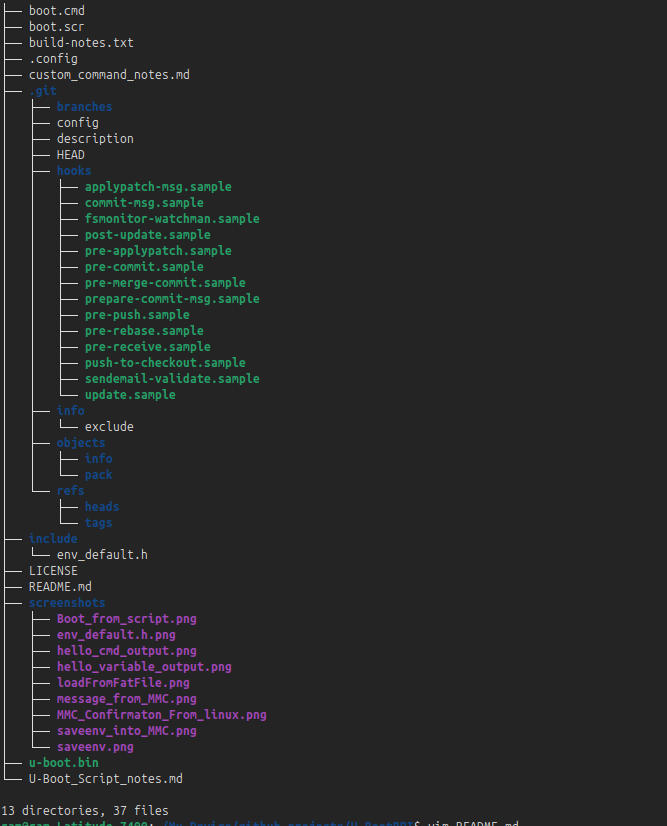
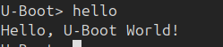
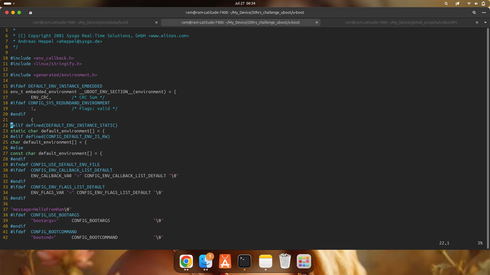
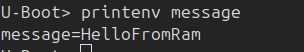
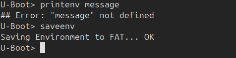
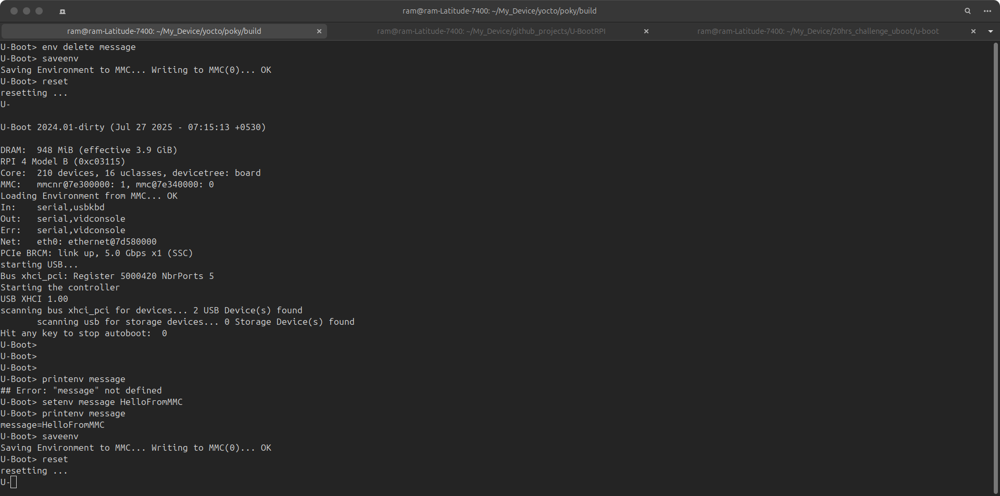
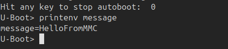
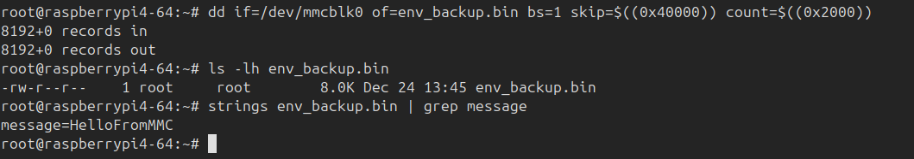

# 🚀 U-Boot Custom Project – Raspberry Pi 4 Model B (64-bit)

This project demonstrates how to build and customize U-Boot for Raspberry Pi 4 Model B.

## 📌 Project Info

- **Project Duration:** July 2025  
- **Author:** Ramkumar B  
- **Description:** Customized U-Boot build for Raspberry Pi 4 Model B (64-bit)

## 📑 Table of Contents
- [Overview](#overview)
- [Project Structure](#project-structure)
- [Features](#features)
- [Build Instructions](#build-instructions)
- [Custom Hello Command](#custom-hello-command)
- [Boot from Script](#boot-from-script)
- [Custom Environment Variable](#custom-environment-variable)
- [Load Environment from FAT](#load-environment-from-fat)
- [Load Environment from MMC](#load-environment-from-mmc)

---

## 📌 Overview

This project demonstrates a customized U-Boot build for Raspberry Pi 4 Model B (64-bit).  
It includes:

- Boot automation using `boot.scr`
- Custom U-Boot command (`hello`)
- Environment variable handling via RAM, FAT, and MMC
- Verification through both runtime and Linux-side inspection

---

## 📂 Project Structure

📸 *

```
├── boot.cmd
├── boot.scr
├── build-notes.txt
├── .config
├── custom_command_notes.md
├── include/env_default.h
├── screenshots/
├── u-boot.bin
├── U-Boot_Script_notes.md
└── README.md
```

---

## ✅ Features

- Script-based booting with `boot.cmd` and `boot.scr`
- Custom command `hello` added to U-Boot CLI
- Environment variable management:
  - Volatile (RAM-only)
  - Persistent via FAT file
  - Persistent via raw MMC offset
- Linux-side validation with `dd` and `strings`

---

## ⚙️ Build Instructions

```bash
make rpi_4_defconfig
make -j$(nproc) CROSS_COMPILE=aarch64-linux-gnu-
```

---

## 🧩 Custom Hello Command

- Integrated using `cmd_hello.c`
- Registered with `U_BOOT_CMD(...)`
- Enable using:

```c
CONFIG_CMD_HELLO=y
```

📄 See: `custom_command_notes.md`  
📸 

---

## 📜 Boot from Script

Create a `boot.cmd` like:

```bash
setenv bootargs 'console=ttyS0,115200 root=/dev/mmcblk0p2 rootwait rw'
load mmc 0:1 ${kernel_addr_r} Image
load mmc 0:1 ${fdt_addr_r} bcm2711-rpi-4-b.dtb
booti ${kernel_addr_r} - ${fdt_addr_r}
```

Convert to `boot.scr`:

```bash
mkimage -C none -A arm64 -T script -d boot.cmd boot.scr
```

📄 See: `U-Boot_Script_notes.md`  
📸 

---

## 🧪 Custom Environment Variable

### ➤ Setup for RAM-only environment:

```c
CONFIG_ENV_IS_NOWHERE=y
```

Add to `include/env_default.h`:

```c
#define CONFIG_EXTRA_ENV_SETTINGS \
    "message=Hello from nowhere env\0"
```

📸   
📸   

❗ `saveenv` is **not supported** in RAM-only mode:  
📸 

---

## 💾 Load Environment from FAT

### ➤ Setup:

```c
# CONFIG_ENV_IS_NOWHERE is not set
CONFIG_ENV_IS_IN_FAT=y
```

U-Boot loads environment from `/boot/boot.env`  
If the file doesn’t exist, defaults are used.

📸 

📝 After editing environment:

```bash
setenv message "Saved in FAT"
saveenv
```

---

## 📦 Load Environment from MMC

### ➤ Setup:

```c
CONFIG_ENV_IS_IN_MMC=y
CONFIG_ENV_OFFSET=0x40000     // 256 KB
CONFIG_ENV_SIZE=0x2000        // 8 KB
CONFIG_SYS_MMC_ENV_DEV=0      // mmc 0
```

📸   
📸 

### ✅ Confirm from Linux

```bash
dd if=/dev/mmcblk0 of=env_backup.bin bs=1 skip=$((0x40000)) count=$((0x2000))
strings env_backup.bin | grep message
```

📸 

📌 When `CONFIG_ENV_IS_IN_MMC` is enabled, U-Boot stores the environment directly into raw space (not as a file) on the SD card at the offset `0x40000`.

---

## 🧾 References

- [U-Boot GitLab Repository](https://source.denx.de/u-boot/u-boot)
- [Raspberry Pi U-Boot Docs](https://u-boot.readthedocs.io/en/latest/board/raspberrypi/)

---
