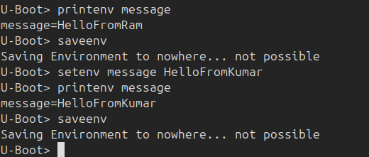

# U-Boot Custom Project – Raspberry Pi 4


## 📑 Table of Contents
- [Project Overview](#project-overview)
- [Project Structure](#project-structure)
- [What’s Included](#whats-included)
- [How to Build](#how-to-build)
- [Custom Hello Command](#custom-hello-command)
- [Boot from Script](#boot-from-own-script)
- [Custom Environment Variables](#custom-hello-variable)
- [Load Environment from FAT](#load-variable-from-fat-file)
- [Load Environment from MMC](#load-variable-from-mmc)


## 📌 Project Overview
This project demonstrates a customized build of U-Boot for Raspberry Pi 4.  
It automates the boot process using `boot.scr` and shows how to configure the U-Boot environment.

## Project Structure

👉 [View Project Structure](screenshots/project_structure.png)

├── boot.cmd
├── boot.scr
├── build-notes.txt
├── .config
├── custom_command_notes.md
├── .git
│   ├── branches
│   ├── config
│   ├── description
│   ├── HEAD
│   ├── hooks
│   │   ├── applypatch-msg.sample
│   │   ├── commit-msg.sample
│   │   ├── fsmonitor-watchman.sample
│   │   ├── post-update.sample
│   │   ├── pre-applypatch.sample
│   │   ├── pre-commit.sample
│   │   ├── pre-merge-commit.sample
│   │   ├── prepare-commit-msg.sample
│   │   ├── pre-push.sample
│   │   ├── pre-rebase.sample
│   │   ├── pre-receive.sample
│   │   ├── push-to-checkout.sample
│   │   ├── sendemail-validate.sample
│   │   └── update.sample
│   ├── info
│   │   └── exclude
│   ├── objects
│   │   ├── info
│   │   └── pack
│   └── refs
│       ├── heads
│       └── tags
├── include
│   └── env_default.h
├── LICENSE
├── README.md
├── screenshots
│   ├── Boot_from_script.png
│   ├── env_default.h.png
│   ├── hello_cmd_output.png
│   ├── hello_variable_output.png
│   ├── loadFromFatFile.png
│   ├── message_from_MMC.png
│   ├── MMC_Confirmaton_From_linux.png
│   ├── saveenv_into_MMC.png
│   └── saveenv.png
├── u-boot.bin
└── U-Boot_Script_notes.md


## 📂 What’s Included

- `boot.cmd` / `boot.scr` for automated script-based booting  
- Custom U-Boot command: `hello` → prints `Hello, U-Boot World!`  
- Environment variable management using:
  - `CONFIG_ENV_IS_NOWHERE` (RAM only)
  - `CONFIG_ENV_IS_IN_FAT` (FAT partition file-based env)
  - `CONFIG_ENV_IS_IN_MMC` (raw MMC offset-based env)
- Demonstrations of saving and verifying env variables from Linux (via `dd`)
- Screenshots showing runtime confirmation of saved variables
- `.config` file included for reproducible builds
- Rebuild and flashing instructions
- Git repository and commit hash info for traceability

## 🚀 How to Build
```bash
make rpi_4_defconfig
make -j$(nproc) CROSS_COMPILE=aarch64-linux-gnu-


### Custom Hello Command

For detailed steps and output of the custom U-Boot `hello` command, see:  
👉 [View Hello Command Integration](custom_command_notes.md)


### Boot from Own Script

For detailed steps and output of the custom U-Boot `hello` command, see:  
👉 [View Boot Script Notes](u_boot_Script_notes.md)


### Custom Hello Variable

	👉 step 1 : Add CONFIG_ENV_IS_NOWHERE=y in u-boot/configs/rpi_arm64_defconfig
	👉 step 2 : Add your custom variable in u-boot/include/env_default.h


	As you set CONFIG_ENV_IS_NOWHERE=y you cannot save any variable

 


### Load variable from FAT file


	👉 Step 1 : Add # CONFIG_ENV_IS_NOWHERE is not set and CONFIG_ENV_IS_IN_FAT=y in u-boot/configs/rpi_arm64_defconfig


	Here you can clearly see your custom variable(message) is not found and when you type saveenv it is saving into FAT file which confirm we loaded variable from FAT file not default environment


	📌 Note: 
	When you set CONFIG_ENV_IS_IN_FAT=y environment varibale will be loaded from /boot/boot.env file.If it doesn't exit then it will fallback into default environment.

### Load variable from MMC

👉 Step 1 : Set the following

        # CONFIG_ENV_IS_IN_FAT is not set
        # CONFIG_ENV_IS_NOWHERE is not set
	CONFIG_ENV_IS_IN_MMC=y
	CONFIG_ENV_OFFSET=0x40000
	CONFIG_ENV_SIZE=0x2000
	CONFIG_SYS_MMC_ENV_DEV=0

	Here you can clearly see your custom variable(message) is not found and when you saveenv message it is showing saving into MMC so after reset you can get the message so we can confirm variables are loading from MMC.

	


	✅ Confirming Environment Storage
	
	You can confirm that U-Boot successfully saved the environment to MMC using the following steps:

👉 Step 1. Dump the environment block using dd if=/dev/mmcblk0 of=env_backup.bin bs=1 skip=$((0x40000)) count=$((0x2000))

	skip=0x40000 – skips 256 KB to reach the environment location.
        count=0x2000 – reads 8 KB (the configured environment size)

👉 Step 2. Confirm the file is created
	ls -lh env_backup.bin

👉 Step 3. Search for saved variables
	strings env_backup.bin | grep message


	📌 Note:
	When CONFIG_ENV_IS_IN_MMC=y, U-Boot stores the environment directly into a raw offset on the eMMC/SD card (not as a file).
	The environment is written to the physical device at the address defined by CONFIG_ENV_OFFSET.
	After running saveenv, the variable is written to this raw space and is preserved across reboots.


