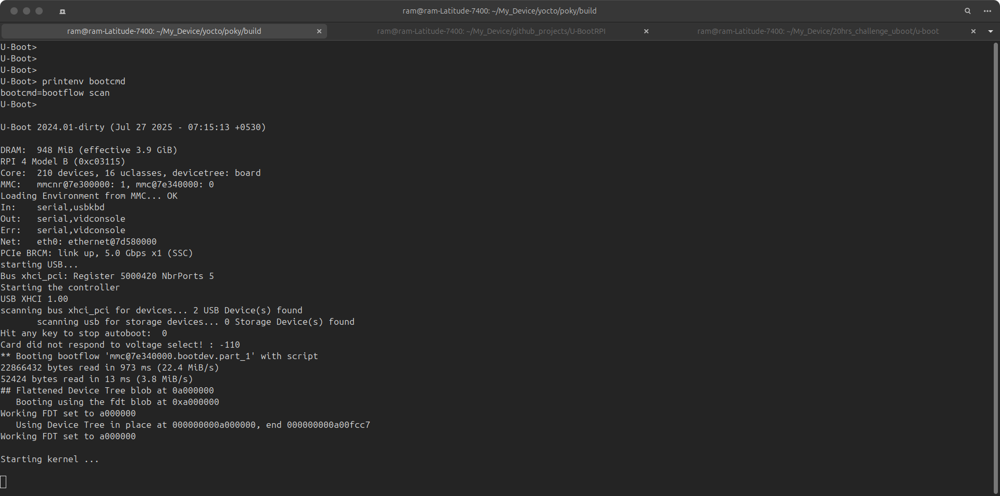

### 🛠️ Booting Using a U-Boot Script (`boot.scr` example)

This section documents how to create and use a custom U-Boot boot script using `boot.cmd` → `boot.scr` for boot automation.

---

### ✅ Goal

To create a U-Boot script that automates booting the Linux kernel and device tree from the SD card using commands written in `boot.cmd`.

---

### 🧾 Step-by-Step Instructions

#### 1. Create a Boot Script Source File

Create a new file:  
`boot.cmd`

Add the following commands (example for Raspberry Pi 4):

```bash
setenv kernel_addr_r 0x08000000
setenv fdt_addr_r 0x0A000000
setenv bootargs console=ttyS0,115200 root=/dev/mmcblk0p2 rootwait rw
load mmc 0:1 ${kernel_addr_r} Image
load mmc 0:1 ${fdt_addr_r} bcm2711-rpi-4-b.dtb
booti ${kernel_addr_r} - ${fdt_addr_r}

2. Convert boot.cmd to boot.scr
Use the mkimage tool (from u-boot-tools) to generate the U-Boot script binary:

mkimage -C none -A arm -T script -d boot.cmd boot.scr
This creates a binary script (boot.scr) that U-Boot can execute.

3. Copy boot.scr to the Boot Partition
Place the boot.scr file into the FAT partition (typically /boot/) of your SD card:

cp boot.scr /media/<user>/boot/
Replace <user> with your Linux username or mount point path.

4. Test Boot Script Execution
After reset or power cycle:
=> boot


or Let it boot automatically your kernel will boot now from your own script




